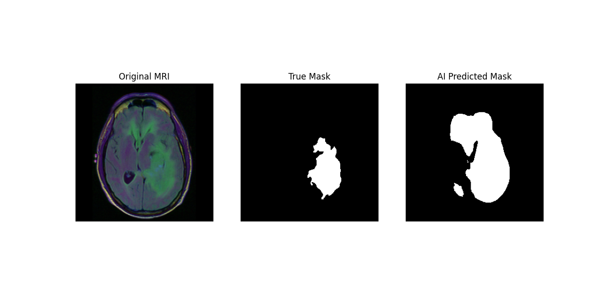

# Brain Tumor Segmentation using U-Net

## Project Overview
This project implements a state-of-the-art Deep Learning model to automate the detection and segmentation of brain tumors (specifically Lower-Grade Gliomas) from Magnetic Resonance Imaging (MRI) scans. By leveraging a U-Net architecture built in PyTorch, the system processes 2D MRI slices to generate precise binary masks that identify tumor boundaries. This tool aims to assist radiologists by reducing the manual effort required for tumor volumetry and treatment planning.

## Problem Statement
Medical image segmentation is a critical step in diagnosing and monitoring cancer. However, manual segmentation is time-consuming, subject to inter-observer variability, and tedious for clinicians. The primary challenge in automating this task is the extreme class imbalance—a tumor may occupy less than 2% of an entire brain scan, causing standard computer vision models to bias heavily toward the healthy background tissue.

## Methodology and Technical Approach
Data Pipeline
- Source: LGG Segmentation Dataset containing multi-patient MRI slices and expert-labeled ground truth masks.
- Preprocessing: Implemented a custom BrainTumorDataset class in PyTorch using OpenCV. Processing steps included channel reordering (HWC --> CHW), normalization (scaling pixel intensities to [0, 1]), and separating valid mask-image pairs from the raw directory structure.Data Split: Utilized an 80/20 train-validation split to ensure the model's performance is evaluated on unseen medical data.
- Data Split: Utilized an 80/20 train-validation split to ensure the model's performance is evaluated on unseen medical data.
## Model Architecture: U-Net
The project employs the U-Net architecture, the gold standard for biomedical image segmentation.
- Encoder: A series of convolutional blocks and MaxPool layers that extract high-level features (texture, shape) while reducing spatial dimension.
- Decoder: Upsampling layers that reconstruct the image size to map features back to specific pixels.
- Skip Connections: Critical links that concatenate high-resolution features from the encoder directly to the decoder, preventing the loss of spatial information during downsampling.
## Key Features
* **Architecture:** U-Net with Skip Connections.
* **Loss Function:** Dice Loss (optimized for medical image segmentation).
* **Data Processing:** Custom PyTorch Dataset loader with OpenCV for image normalization.

## Optimization
- Loss Function: Standard Cross-Entropy loss fails in medical imaging due to class imbalance. This project utilizes Dice Loss, a metric that directly optimizes the overlap (Intersection over Union) between the predicted mask and the ground truth, ensuring the model focuses specifically on the tumor region.
- Training: Trained using the Adam Optimizer with a learning rate of 1e - 4

## Results
The model successfully localizes tumor regions. Below is a sample prediction (Right) compared to the Ground Truth (Center).



## Technology Stack
- Language: Python
- Deep Learning Framework: PyTorch
- Computer Vision: OpenCV, Torchvision
- Data Visualization: Matplotlib
- Development Enviornment: Jupyter Notebook
- 
## How to Run
1. Install dependencies:
   ```bash

   pip install -r requirements.txt
